# Laporan Resmi Praktikum Jarkom Modul 5

| Nama Anggota | NRP |
|--------------|-----|
|Khumaidi Kharis A. | 5027241049|
|Nadia Fauziazahra K. | 5027241094|

## Misi 1

### Nomor 1

Pada soal ini, kami diminta untuk membuat topologi, dengan megidentifikasi setiap perangkatnya 

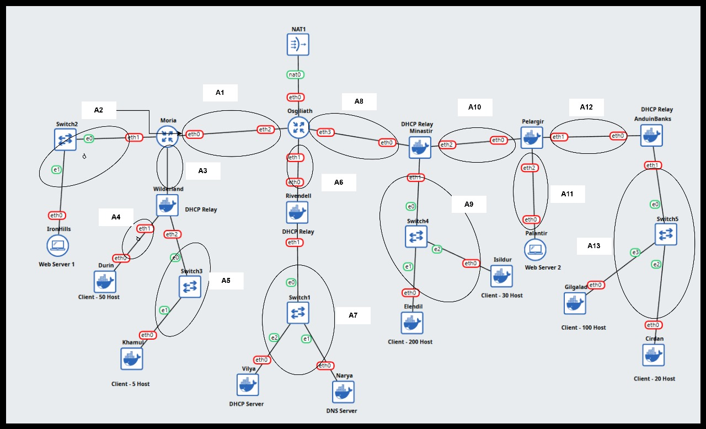

### Nomor 2

Selanjutnya, kita diminta untuk membagi IP berdasarkan metode VLSM. Kita juga perlu membuat tree untuk pembagian IP.

### **Walkthrough**

- Rute

| Nama Subnet | Rute                                           | Jumlah IP | Netmask         | Prefix |
|-------------|------------------------------------------------|-----------|------------------|--------|
| A1          | Osgiliath > Moria                              | 2         | 255.255.255.252 | /30    |
| A2          | Osgiliath > Moria > IronHills                  | 2         | 255.255.255.252 | /30    |
| A3          | Osgiliath > Moria > Wilderland                 | 2         | 255.255.255.252 | /30    |
| A4          | Osgiliath > Moria > Wilderland > Durin         | 51        | 255.255.255.192 | /26    |
| A5          | Osgiliath > Moria > Wilderland > Khamul        | 6         | 255.255.255.248 | /29    |
| A6          | Osgiliath > Rivendell                          | 2         | 255.255.255.252 | /30    |
| A7          | Osgiliath > Rivendell > Vilya, Narya           | 3         | 255.255.255.248 | /29    |
| A8          | Osgiliath > Minastir                           | 2         | 255.255.255.252 | /30    |
| A9          | Osgiliath > Minastir > Elendil, Isildur        | 231       | 255.255.255.0   | /24    |
| A10         | Osgiliath > Minastir > Pelargir                | 2         | 255.255.255.252 | /30    |
| A11         | Osgiliath > Minastir > Pelargir > Palantir     | 2         | 255.255.255.252 | /30    |
| A12         | Osgiliath > Minastir > Pelargir > AnduinBanks  | 2         | 255.255.255.252 | /30    |
| A13         | Osgiliath > Minastir > Pelargir > AnduinBanks > Gilgalad, Cirdan | 121 | 255.255.255.128 | /25 |
| **Total**   |                                                | **426**   | 255.255.254.0   | /23    |

-Subnetting

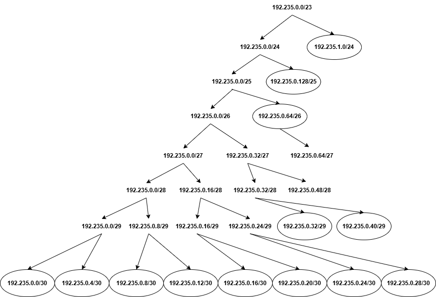

| Subnet | Network ID     | Netmask         | Broadcast        | Range IP                       |
|--------|-----------------|------------------|-------------------|---------------------------------|
| A9     | 192.235.1.0     | 255.255.255.0    | 192.235.1.255     | 192.235.1.1 - 192.235.1.254     |
| A13    | 192.235.0.128   | 255.255.255.128  | 192.235.0.255     | 192.235.0.129 - 192.235.0.254   |
| A4     | 192.235.0.64    | 255.255.255.192  | 192.235.0.127     | 192.235.0.65 - 192.235.0.126    |
| A7     | 192.235.0.40    | 255.255.255.248  | 192.235.0.47      | 192.235.0.41 - 192.235.0.46     |
| A5     | 192.235.0.32    | 255.255.255.248  | 192.235.0.39      | 192.235.0.32 - 192.235.0.37     |
| A12    | 192.235.0.28    | 255.255.255.252  | 192.235.0.31      | 192.235.0.29 - 192.235.0.30     |
| A11    | 192.235.0.24    | 255.255.255.252  | 192.235.0.27      | 192.235.0.25 - 192.235.0.26     |
| A10    | 192.235.0.20    | 255.255.255.252  | 192.235.0.23      | 192.235.0.21 - 192.235.0.22     |
| A8     | 192.235.0.16    | 255.255.255.252  | 192.235.0.19      | 192.235.0.17 - 192.235.0.18     |
| A6     | 192.235.0.12    | 255.255.255.252  | 192.235.0.15      | 192.235.0.13 - 192.235.0.14     |
| A3     | 192.235.0.8     | 255.255.255.252  | 192.235.0.11      | 192.235.0.9 - 192.235.0.10      |
| A2     | 192.235.0.4     | 255.255.255.252  | 192.235.0.7       | 192.235.0.5 - 192.235.0.6       |
| A1     | 192.235.0.0     | 255.255.255.252  | 192.235.0.3       | 192.235.0.1 - 192.235.0.2       |

### Nomor 3

Pada nomor ini, kita perlu membuat konfigurasi di setiap node, agar semua prangkat bisa saling terhubung satu sama lain

### **Walkthrough**

[Osgiliath]

```bash
auto lo
iface lo inet loopback
    up sysctl -w net.ipv4.ip_forward=1

# Ke Internet (NAT1) - DHCP
auto eth0
iface eth0 inet dhcp

# Ke Rivendell (A6)
auto eth1
iface eth1 inet static
    address 192.235.0.13
    netmask 255.255.255.252

# Ke Moria (A1)
auto eth2
iface eth2 inet static
    address 192.235.0.1
    netmask 255.255.255.252

# Ke Minastir (A8)
auto eth3
iface eth3 inet static
    address 192.235.0.17
    netmask 255.255.255.252

# === ROUTING STATIS ===
up ip route add 192.235.0.4/30 via 192.235.0.2
up ip route add 192.235.0.8/30 via 192.235.0.2
up ip route add 192.235.0.64/26 via 192.235.0.2
up ip route add 192.235.0.32/29 via 192.235.0.2

up ip route add 192.235.0.40/29 via 192.235.0.14

up ip route add 192.235.1.0/24 via 192.235.0.18
up ip route add 192.235.0.20/30 via 192.235.0.18
up ip route add 192.235.0.24/30 via 192.235.0.18
up ip route add 192.235.0.28/30 via 192.235.0.18
up ip route add 192.235.0.128/25 via 192.235.0.18
```bash

[Moria]

```bash
auto lo
iface lo inet loopback
    up sysctl -w net.ipv4.ip_forward=1

auto eth0
iface eth0 inet static
    address 192.235.0.2
    netmask 255.255.255.252
    up ip route add default via 192.235.0.1
    up echo nameserver 192.168.122.1 > /etc/resolv.conf

auto eth1
iface eth1 inet static
    address 192.235.0.5
    netmask 255.255.255.252

auto eth2
iface eth2 inet static
    address 192.235.0.9
    netmask 255.255.255.252

# Routing ke Wilderland
up ip route add 192.235.0.64/26 via 192.235.0.10
up ip route add 192.235.0.32/29 via 192.235.0.10
```

[Wilderland]

```bash
auto lo
iface lo inet loopback
    up sysctl -w net.ipv4.ip_forward=1

auto eth0
iface eth0 inet static
    address 192.235.0.10
    netmask 255.255.255.252
    up ip route add default via 192.235.0.9
    up echo nameserver 192.168.122.1 > /etc/resolv.conf

auto eth1
iface eth1 inet static
    address 192.235.0.65
    netmask 255.255.255.192

auto eth2
iface eth2 inet static
    address 192.235.0.33
    netmask 255.255.255.248
```

[Rivendell]

```bash
auto lo
iface lo inet loopback
    up sysctl -w net.ipv4.ip_forward=1

auto eth0
iface eth0 inet static
    address 192.235.0.14
    netmask 255.255.255.252
    up ip route add default via 192.235.0.13
    up echo nameserver 192.168.122.1 > /etc/resolv.conf

auto eth1
iface eth1 inet static
    address 192.235.0.41
    netmask 255.255.255.248
```

[Minastir]

```bash
auto lo
iface lo inet loopback
    up sysctl -w net.ipv4.ip_forward=1

auto eth0
iface eth0 inet static
    address 192.235.0.18
    netmask 255.255.255.252
    up ip route add default via 192.235.0.17
    up echo nameserver 192.168.122.1 > /etc/resolv.conf

auto eth1
iface eth1 inet static
    address 192.235.1.1
    netmask 255.255.255.0

auto eth2
iface eth2 inet static
    address 192.235.0.21
    netmask 255.255.255.252

# Routing ke Pelargir
up ip route add 192.235.0.24/30 via 192.235.0.22
up ip route add 192.235.0.28/30 via 192.235.0.22
up ip route add 192.235.0.128/25 via 192.235.0.22
```

[Pelargir]

```bash
auto lo
iface lo inet loopback
    up sysctl -w net.ipv4.ip_forward=1

auto eth0
iface eth0 inet static
    address 192.235.0.22
    netmask 255.255.255.252
    up ip route add default via 192.235.0.21

auto eth1
iface eth1 inet static
    address 192.235.0.29
    netmask 255.255.255.252

auto eth2
iface eth2 inet static
    address 192.235.0.25
    netmask 255.255.255.252

up ip route add 192.235.0.128/25 via 192.235.0.30
```

[AnduinBanks]

```bash
auto lo
iface lo inet loopback
    up sysctl -w net.ipv4.ip_forward=1

auto eth0
iface eth0 inet static
    address 192.235.0.30
    netmask 255.255.255.252
    up ip route add default via 192.235.0.29
    up echo nameserver 192.168.122.1 > /etc/resolv.conf

auto eth1
iface eth1 inet static
    address 192.235.0.129
    netmask 255.255.255.128
```

[Vilya]

```bash
auto eth0
iface eth0 inet static
	address 192.235.0.43
	netmask 255.255.255.248
	gateway 192.235.0.41

up echo nameserver 192.168.122.1 > /etc/resolv.conf
```

[Narya]

```bash
auto eth0
iface eth0 inet static
	address 192.235.0.42
	netmask 255.255.255.248
	gateway 192.235.0.41

up echo nameserver 192.168.122.1 > /etc/resolv.conf
```

[IronHills]

```bash
auto eth0
iface eth0 inet static
	address 192.235.0.6
	netmask 255.255.255.252
	gateway 192.235.0.5

up echo nameserver 192.168.122.1 > /etc/resolv.conf
```

[Palantir]

```bash
auto eth0
iface eth0 inet static
	address 192.235.0.26
	netmask 255.255.255.252
	gateway 192.235.0.25
    up echo nameserver 192.168.122.1 > /etc/resolv.conf
```

[semua client]

```bash
auto eth0
iface eth0 inet dhcp
up echo nameserver 192.168.122.1 > /etc/resolv.conf
```

[Testing dari ironhills ke Palantir]

```bash
ping 192.235.0.30 -c 4
```


### Nomor 4 (Pengerjaan ini seletah Misi 2 Nomor 1)

Pada soal ini, kami diminta mengerjakan beberapa poin, antara lain

1. Vilya sebagai DHCP Server agar perangkat dalam Khamul, Durin, Gilgalad, Elendil, Cirdan, dan Isildur menerima IP otomatis.
2. AnduinBanks, Rivendell, dan Minastir berfungsi sebagai DHCP Relay.
3. Narya sebagai DNS Server.
4. Palantir dan IronHills sebagai Web Server (Apache/Nginx).
5. Buat index.html berisikan : "Welcome to {hostname}".

### **Walkthrough**

[Vilya]

```bash
apt-get update && apt-get install isc-dhcp-server -y
nano /etc/default/isc-dhcp-server
```

#isi

INTERFACESv4="eth0"

```bash
nano /etc/dhcp/dhcpd.conf
```

#isi bagian ini

```bash
default-lease-time 600;
max-lease-time 7200;
option domain-name-servers 192.235.0.42; 
option domain-name "aliansi.rpl";

subnet 192.235.0.40 netmask 255.255.255.248 {
}

subnet 192.235.0.32 netmask 255.255.255.248 {
    range 192.235.0.34 192.235.0.38;
    option routers 192.235.0.33;
}

subnet 192.235.0.64 netmask 255.255.255.192 {
    range 192.235.0.66 192.235.0.126;
    option routers 192.235.0.65;
}

subnet 192.235.1.0 netmask 255.255.255.0 {
    range 192.235.1.2 192.235.1.254;
    option routers 192.235.1.1; 
}

subnet 192.235.0.128 netmask 255.255.255.128 {
    range 192.235.0.130 192.235.0.254;
    option routers 192.235.0.129; 
}
```

Selanjutnya restart DHCP server

```bash
service isc-dhcp-server restart
```

[Minastir, AnduinBanks, Rivendell, dan Wilderland]

```bash
apt-get update && apt-get install isc-dhcp-relay -y
nano /etc/default/isc-dhcp-relay
```

ubah bagian berikut

```bash
SERVERS="192.235.0.43"
INTERFACES=""
```

Selanjutnya, restart DHCP relay

```bash
service isc-dhcp-relay restart
```

[Narya]

```bash
apt-get update && apt-get install bind9 -y
nano /etc/bind/named.conf.local
```

Isi bagian beriktu

```bash
zone "aliansi.rpl" {
    type master;
    file "/etc/bind/db.aliansi";
};
```

Buat databse

```bash
nano /etc/bind/db.aliansi
```

Isi berikut

```bash
;
; BIND data file for aliansi.rpl
;
$TTL    604800
@       IN      SOA     aliansi.rpl. root.aliansi.rpl. (
                              2         ; Serial
                         604800         ; Refresh
                          86400         ; Retry
                        2419200         ; Expire
                         604800 )       ; Negative Cache TTL
;
@       IN      NS      aliansi.rpl.
@       IN      A       192.235.0.42
palantir IN     A       192.235.0.26
ironhills IN    A       192.235.0.6
```

Selanjutnya buat config forwarder

```bash
nano /etc/bind/named.conf.options
```

Isi cinfig berikut

```bash
options {
    directory "/var/cache/bind";
    
    forwarders {
        8.8.8.8;
    };
    
    allow-query { any; };
    dnssec-validation no;
};
```

Terakhir, run service

```bash
service named start
```

[Palantir]

Aktifkan service nginx server Palantir
```bash
apt-get update && apt-get install nginx -y
echo "Welcome to Palantir" > /var/www/html/index.html
service nginx start
```

[IronHills]

Aktifkan service nginx server Palantir

```bash
apt-get update && apt-get install nginx -y
echo "Welcome to IronHills" > /var/www/html/index.html
service nginx start
```


### **Testing** (ex Durin/Elendil)

```bash
apt-get update && apt-get install isc-dhcp-client -y
dhclient -v eth0
ip a
```

note:
1. IP durin harus antara 192.235.0.66 s.d 192.235.0.126
2. IP Elendil harus antara 192.235.1.2 s.d 192.235.1.254

Selanjutnya, cek nameserver(Harus ada: nameserver 192.235.0.42)
```bash
cat /etc/resolv.conf
```

Cek DNS Resolve

```bash
nslookup palantir.aliansi.rpl
nslookup ironhills.aliansi.rpl
```

Output palantir.aliansi.rpl harus: Address 192.235.0.26

Output ironhills.aliansi.rpl harus: Address 192.235.0.6

Tes Web Server

```bash
curl palantir.aliansi.rpl
curl ironhills.aliansi.rpl
```

Ping google.com, dan harus reply

```bash
ping google.com -c 3
```


## Misi 2

### Nomor 1

Soal ini meminta kami untuk mengamankan jaringan dengan menerapkan aturan-aturan firewall, lalu membuat koneksi jaringan Aliansi bisa keluar menuju Valinor/Internet menggunakan iptables. Namun, kami harus melakukan routing tanpa menggunakan target MASQUERADE, sehingga kami wajib memakai metode lain seperti SNAT dengan IP publik yang sudah ditentukan. Dengan begitu, firewall tetap aman dan trafik keluar tetap dapat diteruskan ke luar jaringan.

### **Walkthrough**

[Osgiliath]

Tambahkan config berikut pada configurasi Osgialath

```bash
post-up sleep 5 && IP=$(ip -4 addr show eth0 | grep inet | awk '{print $2}' | cut -d/ -f1) && iptables -t nat -A POSTROUTING -s 192.235.0.0/23 -o eth0 -j SNAT --to-source $IP
```

### **Testing**

[Osgialat]

```bash
ping google.com -c3
```

[Durin]

```bash
ping google.com -c3
```


### Nomor 2

Soal ini meminta Kami membuat aturan firewall agar server Vilya (DHCP) tidak bisa di-ping oleh perangkat mana pun, sehingga lebih aman. Tapi sebaliknya, Vilya tetap bebas melakukan ping dan akses ke semua perangkat lain, jadi pemblokiran hanya satu arah (incoming ke Vilya), bukan outgoing dari Vilya.

### **Walkthrough**

[Vilya]

ganti config seperti berikut

```bash
auto eth0
iface eth0 inet static
    address 192.235.0.43
    netmask 255.255.255.248
    gateway 192.235.0.41
    up echo nameserver 192.168.122.1 > /etc/resolv.conf
    up iptables -A INPUT -i eth0 -p icmp --icmp-type echo-request -j REJECT
```

### **Testing**

[client mana saja ping ke vilya]

```bash
ping 192.235.0.43 -c 3
```

[vilya ping ke client]

```bash
ping 192.235.0.66 -c 3
ping 8.8.8.8 -c 3
```

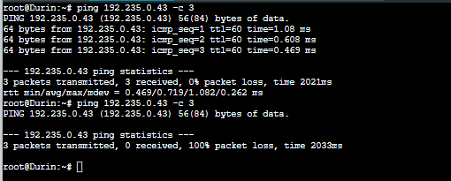
---
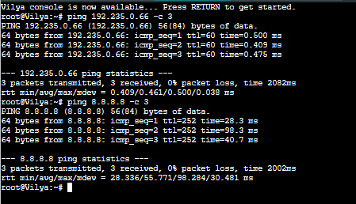


### Nomor 3

Soal ini meminta kami membuat aturan firewall yang membatasi agar hanya Vilya yang boleh mengakses Narya (DNS) pada port 53, sehingga lokasi pasukan tetap aman dan tidak bisa diakses perangkat lain. Setelah itu, kami harus melakukan pengecekan menggunakan nc (netcat) untuk memastikan port 53 memang hanya terbuka untuk Vilya. Aturan ini sifatnya sementara, jadi harus dihapus setelah pengujian supaya internet kembali normal untuk instalasi paket.

### **Walkthrough**

[Narya]

Ubah config menjadi berikut

```bash
auto eth0
iface eth0 inet static
    address 192.235.0.42
    netmask 255.255.255.248
    gateway 192.235.0.41
    up echo nameserver 192.168.122.1 > /etc/resolv.conf

    # === SECURITY RULES (MISI 2) ===
    # 1. Izinkan akses DNS (UDP dan TCP) HANYA dari Vilya (192.235.0.43)
    up iptables -A INPUT -i eth0 -p udp --dport 53 -s 192.235.0.43 -j ACCEPT
    up iptables -A INPUT -i eth0 -p tcp --dport 53 -s 192.235.0.43 -j ACCEPT
    
    # 2. Tolak (REJECT) SEMUA akses DNS (Port 53) dari IP LAIN
    up iptables -A INPUT -i eth0 -p udp --dport 53 -j REJECT
    up iptables -A INPUT -i eth0 -p tcp --dport 53 -j REJECT
    
    # 3. Tetap Izinkan Akses Balik (misalnya balasan ping atau balasan query)
    up iptables -A INPUT -m state --state ESTABLISHED,RELATED -j ACCEPT
    
    # 4. Tolak Sisanya (Opsional, tapi bagus untuk keamanan)
    up iptables -P INPUT REJECT
```

Selanjutnya, aktifkan service Narya

```bash
service named start
```

### **Testing**

[Vilya] (bisa diakses)

```bash
apt-get update && apt-get install netcat-openbsd -y
nc -zvu 192.235.0.42 53
```
[Durin] (ditolak)

```bash
apt-get install netcat-openbsd -y
nc -zv -w 3 192.235.0.42 53
```

Terakhir, hapus setelah pengujian

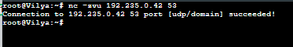
---
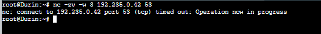

### Nomor 4

Soal ini meminta kami membuat aturan firewall berbasis waktu (time-based rules) sehingga IronHills hanya dapat diakses pada hari Sabtu dan Minggu. Selain itu, akses hanya boleh diberikan untuk perangkat dari faksi Kurcaci & Pengkhianat (Durin dan Khamul) serta faksi Manusia (Elendil dan Isildur). Karena kondisi yang disimulasikan adalah hari Rabu, maka seluruh akses harus ditolak, dan kami perlu membuktikannya dengan melakukan uji akses menggunakan curl untuk memastikan bahwa blokir waktu benar-benar bekerja.

### **Walkthrough**

[IronHills]

Tambah config berikut 

```bash
# 1. Aturan Waktu: BLOKIR jika Senin s.d Jumat (Weekdays)
up iptables -A INPUT -p tcp --dport 80 -m time --weekdays Mon,Tue,Wed,Thu,Fri -j REJECT

# 2. Aturan Faksi: IZINKAN Subnet Teman (Hanya akan diproses jika Lolos aturan No 1 / Hari Sabtu-Minggu)
# Faksi Kurcaci (Durin - A4)
up iptables -A INPUT -p tcp --dport 80 -s 192.235.0.64/26 -j ACCEPT
# Faksi Pengkhianat (Khamul - A5)
up iptables -A INPUT -p tcp --dport 80 -s 192.235.0.32/29 -j ACCEPT
# Faksi Manusia (Elendil & Isildur - A9)
up iptables -A INPUT -p tcp --dport 80 -s 192.235.1.0/24 -j ACCEPT

# 3. Aturan Sisa: BLOKIR Siapapun yang tidak masuk daftar teman (Contoh: Elf Gilgalad)
up iptables -A INPUT -p tcp --dport 80 -j REJECT
```

### **Testing**

Pastikan web server dan nginx ironhills aktif

[IronHills]

```bash
date -s "2025-10-01 10:00:00"
```

[Durin]

```bash
apt-get update
curl ironhills.aliansi.rpl
```

Selanjutnya, ubah hari di ironhills (sat), lalu ulangi tes durin

[IronHills]

```bash
date -s "2025-10-04 10:00:00"
```

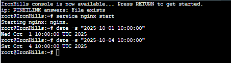
---
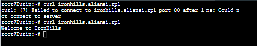

### Nomor 5

Nomor ini meminta penerapan firewall berbasis waktu di Palantir: Elf (Gilgalad & Cirdan) hanya boleh akses jam 07.00–15.00, sedangkan Manusia (Elendil & Isildur) hanya boleh jam 17.00–23.00. Pengujiannya dilakukan dengan curl untuk memastikan akses diizinkan pada jam yang benar dan ditolak di luar jam tersebut.

### **Walkthrough**

[Palantir]

Ubah config berikut pada Palantir

```bash
auto eth0
iface eth0 inet static
	address 192.235.0.26
	netmask 255.255.255.252
	gateway 192.235.0.25
    up echo nameserver 192.168.122.1 > /etc/resolv.conf

    # 1. Aturan Faksi ELF (Subnet A13: 192.235.0.128/25)
    # Izinkan HANYA jam 07.00 - 15.00
    up iptables -A INPUT -p tcp --dport 80 -s 192.235.0.128/25 -m time --timestart 07:00 --timestop 15:00 -j ACCEPT

    # 2. Aturan Faksi MANUSIA (Subnet A9: 192.235.1.0/24)
    # Izinkan HANYA jam 17.00 - 23.00
    up iptables -A INPUT -p tcp --dport 80 -s 192.235.1.0/24 -m time --timestart 17:00 --timestop 23:00 -j ACCEPT

    # 3. Aturan Sisa: BLOKIR SEMUA akses Web selain yang diizinkan di atas
    # (Jika Elf akses jam 16.00, dia tidak kena aturan 1, maka jatuh ke sini -> REJECT)
    up iptables -A INPUT -p tcp --dport 80 -j REJECT
```

### **Testing**

Pastikan nginx palantir dan web server aktif

[Palantir]

case 1 (jam 10)

```bash
date -s "10:00:00"
```

[Gilgalad dan Elendil]

```bash
curl palantir.aliansi.rpl
```

[Palantir]

case 2 (jam 20)

```bash
date -s "20:00:00"
```

Lakukan pengujian yang sama di Gilgalad dan Elendil


---

---
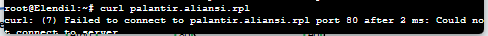


### Nomor 6

Soal ini meminta saya mensimulasikan port scan dari Elendil ke Palantir (nmap 1–100) dan membuat aturan firewall yang mendeteksi lebih dari 15 koneksi dalam 20 detik. Jika terdeteksi, iptables harus memblokir penyerang, mencatat log dengan prefix "PORT_SCAN_DETECTED", dan setelah itu penyerang tidak boleh bisa ping, nc, atau curl ke Palantir.

### **Walkthrough**

[Palantir]

Tambahkan config berikut sebelum aturan waktu

```bash
# === SECURITY RULES (PORT SCAN PROTECTION) ===
    
# 1. CEK BLACKLIST: Apakah IP ini sudah ditandai sebagai penyerang?
# Jika IP ada di daftar 'penyerang_terblokir' (update list agar durasi blokir diperpanjang), REJECT paketnya.
# Ini memenuhi syarat (b): Penyerang tidak bisa ping, nc, atau curl.
up iptables -A INPUT -m recent --name penyerang_terblokir --update --seconds 60 -j REJECT

# 2. LOGGING: Jika IP mengetuk lebih dari 15 kali dalam 20 detik
# Syarat (a) & (c): Catat ke Log sistem.
up iptables -A INPUT -m state --state NEW -m recent --name penghitung_scan --rcheck --seconds 20 --hitcount 15 -j LOG --log-prefix "PORT_SCAN_DETECTED: "

# 3. BLOKIR: Jika IP mengetuk lebih dari 15 kali dalam 20 detik
# Masukkan IP tersebut ke daftar 'penyerang_terblokir' lalu REJECT.
up iptables -A INPUT -m state --state NEW -m recent --name penghitung_scan --rcheck --seconds 20 --hitcount 15 -m recent --name penyerang_terblokir --set -j REJECT

# 4. PENDAFTARAN: Catat setiap koneksi baru ke daftar 'penghitung_scan'
up iptables -A INPUT -m state --state NEW -m recent --name penghitung_scan --set
```

### **Testing**

[Elendil]

```bash
apt-get update && apt-get install nmap -y
nmap -p 1-100 192.235.0.26
```

Tes Ping (Harus RTO)

```bash
ping 192.235.0.26 -c 3
```

Tes Web (Harus Time Out)

```bash
curl 192.235.0.26
```

Tes Netcat (Harus Time Out)

```bash
nc -zv -w 3 192.235.0.26 80
```

[Palantir]

Baca kernel log

```bash
dmesg | tail -n 20
```

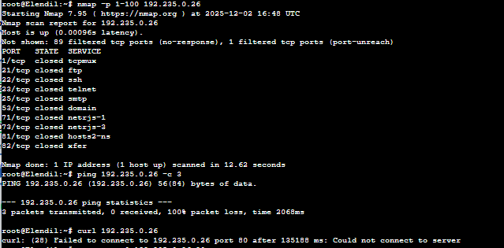
---
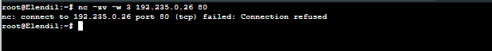
---
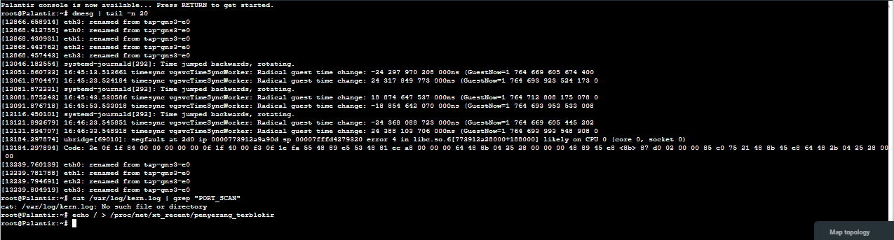

### Nomor 7

Nomor ini meminta pembatasan koneksi (connection limit) ke IronHills. Dalam aturan firewall, tiap IP hanya boleh memiliki maksimal 3 koneksi aktif sekaligus menuju IronHills. Setelah aturan diterapkan, dilakukan uji beban menggunakan curl berulang atau ab (ApacheBench) untuk memastikan bahwa koneksi ke-4 dan seterusnya akan ditolak oleh server.

### **Walkthrough**

[IronHills]

Ubah config menjadi berikut

```bash
auto lo
iface lo inet loopback
    up sysctl -w net.ipv4.ip_forward=1

auto eth0
iface eth0 inet static
    address 192.235.0.6
    netmask 255.255.255.252
    gateway 192.235.0.5
    # DNS untuk kebutuhan install paket
    up echo nameserver 192.168.122.1 > /etc/resolv.conf

    up iptables -F

    # Jika koneksi > 3, langsung tolak. Jangan buang waktu cek hari/teman.
    up iptables -A INPUT -p tcp --syn --dport 80 -m connlimit --connlimit-above 3 -j REJECT

    # Tolak akses Senin-Jumat
    up iptables -A INPUT -p tcp --dport 80 -m time --weekdays Mon,Tue,Wed,Thu,Fri -j REJECT

    # Izinkan Teman (Kurcaci & Manusia)
    up iptables -A INPUT -p tcp --dport 80 -s 192.235.0.64/26 -j ACCEPT
    up iptables -A INPUT -p tcp --dport 80 -s 192.235.0.32/29 -j ACCEPT
    up iptables -A INPUT -p tcp --dport 80 -s 192.235.1.0/24 -j ACCEPT

    # 4. ATURAN SISA (Blokir Orang Asing / Elf di Hari Libur)
    up iptables -A INPUT -p tcp --dport 80 -j REJECT
```

### **Walkthrough**

[IronHills]

Set waktu ke HARI SABTU

```bash
date -s "2025-10-04 10:00:00"
```

[Elendil]

```bash
apt-get update && apt-get install apache2-utils -y
ab -n 100 -c 10 http://ironhills.aliansi.rpl/
```

Ubah hari di ironhills (wed)

```bash
date -s "2025-10-01 10:00:00"
```

Selanjutnya tes lagi di Elendil
